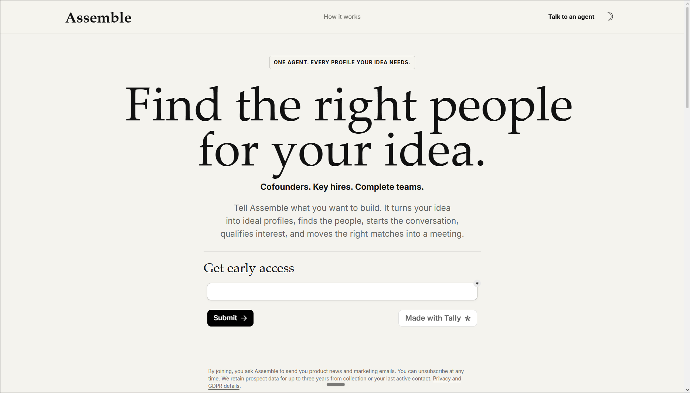
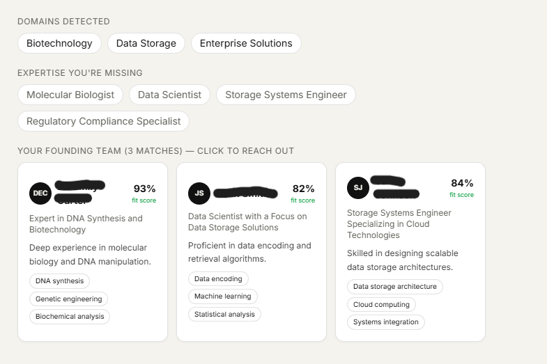
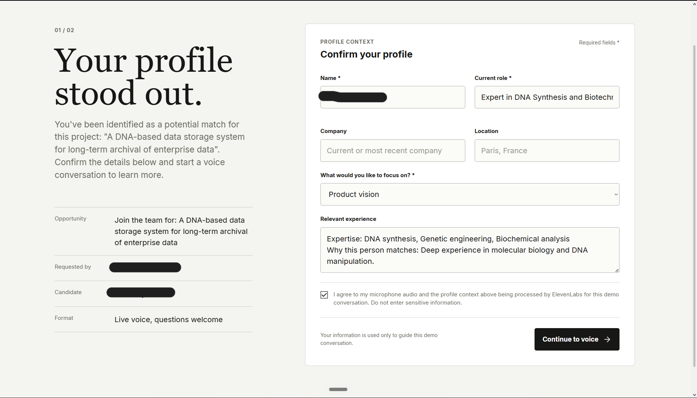

<div align="center">

# Assemble

**Turn an idea into a founding team.**

Assemble decomposes an idea into the expertise you're missing, finds real people for each
role on the public web, explains every match, drafts human-approved outreach, and plans the
first 30 days — an AI venture-builder run by agents.

Built at the **World's Largest Hermes Buildathon** (Paris edition) · Track: *AI as Agency*


</div>

---

## Table of contents

- [Overview](#overview)
- [Demo](#demo)
- [How it works](#how-it-works)
- [Architecture](#architecture)
- [Tech stack](#tech-stack)
- [Project structure](#project-structure)
- [Getting started](#getting-started)
- [Deployment](#deployment)
- [Observability](#observability)
- [Roadmap](#roadmap)
- [Team](#team)
- [Acknowledgements](#acknowledgements)
- [License](#license)

---

## Overview

The hardest part of an ambitious project is rarely the idea — it's finding the right people.
The exact expertise you're missing is almost never in your own network, and a keyword search
doesn't help when you don't even know the job title to look for.

**Assemble** solves that. You describe what you want to build, in text or by voice, and a set
of agents turn it into a founding team:

- it **decomposes** the idea into domains, engineering challenges, missing expertise and risks;
- it **sources** real people for each role across the public web;
- it **explains** every recommendation with a fit score and evidence;
- it **drafts outreach** you approve before anything is sent;
- and the person on the other end can have a **live voice conversation** with an agent about
  the project instead of receiving a cold message.

The app runs end to end in two modes (see [Getting started](#getting-started)): a zero-config
**demo mode** that works offline, and a **full mode** wired to Convex, OpenAI, Linkup and
ElevenLabs.

## Demo

<div align="center">



_Describe your idea, by text or by voice._



_Assemble decomposes the idea and sources real people for each role, each with a fit score._



_Instead of a cold message, the candidate can hold a live voice conversation with an agent._

</div>

## How it works

Assemble is organised as a small multi-agent pipeline. A manager decomposes the request and
fans out to specialist scouts, one per missing expertise.

| Agent | Responsibility |
|-------|----------------|
| **Strategy** | Turns the idea into `domains`, `challenges`, `missingExpertise`, `risks`, and clarifying questions when the idea is underspecified. Produces the persona list (roles to fill). |
| **Talent Scout** | For each persona, runs a structured Linkup search across LinkedIn, Google Scholar and GitHub, deduplicates results, ranks them, and flags the single best-fit. |
| **Outreach** | Drafts a personalized message per candidate. Nothing is sent without explicit human approval. |
| **Execution** | Produces a first 30-day roadmap, team roles and milestones. |

Every run and every agent step is recorded (see [Observability](#observability)).

## Architecture

The guiding principle is **all heavy logic lives in Convex actions, not in Next.js server
routes**. Calls to OpenAI, Linkup and ElevenLabs run inside Convex (Node runtime); the
Cloudflare Worker only serves the Next.js frontend and thin routes that talk to Convex over
the network.

This keeps the Worker well under its size limit, avoids Node-runtime compatibility issues at
the edge, and still runs the whole product live on Cloudflare.

```
┌─────────────────────┐        ┌──────────────────────────────┐
│  Next.js (frontend)  │  RPC   │  Convex (backend + DB)         │
│  on Cloudflare Workers ─────► │  actions · queries · mutations │
│  via OpenNext         │        │  ┌──────────────────────────┐ │
└─────────────────────┘        │  │ OpenAI · Linkup · Eleven  │ │
                                │  │ Labs · Resend · Dodo      │ │
                                │  └──────────────────────────┘ │
                                │  observability: runs + steps  │
                                └──────────────────────────────┘
```

**Graceful degradation.** When no OpenAI key is configured, the Strategy step falls back to a
deterministic decomposition so the public funnel never fails; when no Convex URL is set, the
app runs fully in demo mode.

## Tech stack

| Layer | Technology |
|-------|------------|
| Framework | Next.js 15 (App Router) + TypeScript |
| Backend / DB / realtime / orchestration | Convex |
| People search | Linkup (`linkup-sdk`, structured output) |
| Reasoning (decomposition, ranking, drafting) | OpenAI (`gpt-4o-mini` by default, configurable) |
| Voice | ElevenLabs (speech-to-text + text-to-speech) |
| Outreach email | Resend |
| Payments (unlock the best-fit) | Dodo Payments |
| Deployment | Cloudflare Workers via OpenNext (`@opennextjs/cloudflare`) |
| Styling | Tailwind CSS |

## Project structure

```
Assemble/
├── src/
│   ├── app/
│   │   ├── page.tsx              # public teaser: idea → preview → email capture
│   │   ├── app/page.tsx          # full app: idea → personas → ranked candidates
│   │   └── api/demo/             # demo-mode routes (lead, strategy, pipeline)
│   ├── components/Teaser.tsx
│   └── lib/backend.ts            # mode-aware client (demo vs full)
├── convex/
│   ├── schema.ts                 # users, projects, personas, candidates,
│   │                             #   outreach, decisions, preferences, usage,
│   │                             #   payments, agent_runs, agent_steps
│   ├── strategy.ts               # Strategy agent (decomposition)
│   ├── scout.ts                  # full pipeline: strategy → Linkup → ranking
│   ├── pipeline.ts               # persistence + freemium gating
│   ├── leads.ts                  # teaser email capture
│   ├── observability.ts          # run/step logging + read API
│   ├── voice.ts                  # ElevenLabs STT/TTS
│   └── lib/                      # openai, scout, strategy helpers
├── voice-agent/                  # standalone voice module (STT + TTS + chat)
├── open-next.config.ts
├── wrangler.jsonc
└── next.config.ts
```

## Getting started

### Prerequisites

- Node.js 18+ and a single package manager (keep one lockfile)
- A [Convex](https://convex.dev) account (for full mode)

### Demo mode (zero accounts — works immediately)

```bash
npm install
npm run dev          # http://localhost:3000
```

Type an idea, see the decomposition and preview candidate cards, and leave an email. Captured
leads are written to `.dev-data/leads.json` (inspect them via `GET /api/demo/lead`).

### Full mode (live agents)

```bash
npx convex dev       # one-time login; writes NEXT_PUBLIC_CONVEX_URL to .env.local
```

The heavy secrets run inside Convex actions, so set them on Convex rather than in `.env.local`:

```bash
npx convex env set OPENAI_API_KEY sk-...
npx convex env set LINKUP_API_KEY ...
npx convex env set ELEVENLABS_API_KEY ...
npx convex env set ELEVENLABS_VOICE_ID ...
npx convex env set RESEND_API_KEY ...
# optional model override (defaults to gpt-4o-mini)
npx convex env set OPENAI_MODEL gpt-4o-mini
```

Then run `npm run dev` and open the app at `/app`.

### Environment variables

| Variable | Where | Purpose |
|----------|-------|---------|
| `NEXT_PUBLIC_CONVEX_URL` | `.env.local` | Enables full mode |
| `OPENAI_API_KEY` | Convex | Strategy, ranking, drafting |
| `OPENAI_MODEL` | Convex | Model override (default `gpt-4o-mini`) |
| `LINKUP_API_KEY` | Convex | Real people search |
| `ELEVENLABS_API_KEY` / `ELEVENLABS_VOICE_ID` | Convex | Voice STT/TTS |
| `RESEND_API_KEY` | Convex | Outreach email |
| Dodo Payments keys | Convex | Unlock the best-fit |

## Deployment

Assemble deploys to **Cloudflare Workers** through the OpenNext adapter.

```bash
npm run deploy       # opennextjs-cloudflare build && deploy
```

Configuration lives in `wrangler.jsonc` (`nodejs_compat` + a recent `compatibility_date`) and
`open-next.config.ts`. Runtime secrets are set with `wrangler secret put <NAME>` or in the
Cloudflare dashboard; local Wrangler reads `.dev.vars`. The `.open-next` build output is
git-ignored.

You can also connect the repository to Cloudflare Workers Builds for push-to-deploy.

## Observability

Every pipeline run writes an `agent_runs` row, and each agent step writes an `agent_steps` row
capturing the agent, input, output, token count, cost and latency, linked into a tree via
`parentStepId`. A read API (`listRuns`, `getRun`) exposes this so you can inspect any past run
step by step, with per-step tokens and cost.

## Roadmap

- [ ] Merge the standalone voice module into the main app flow
- [ ] Reply handling: parse candidate responses and schedule a first call
- [ ] Persistent preference learning across projects
- [ ] Team/organization workspaces

## Acknowledgements

Built at the **World's Largest Hermes Buildathon** by GrowthX — 10 cities, 5 countries, one
weekend — on **Hermes** (Nous Research). Thanks to the partners whose tools power Assemble:
OpenAI, Convex, Linkup, ElevenLabs, Dodo Payments and Cloudflare, and to the hosts, mentors
and judges of the Paris room.

## License

Released under the [MIT License](LICENSE).
